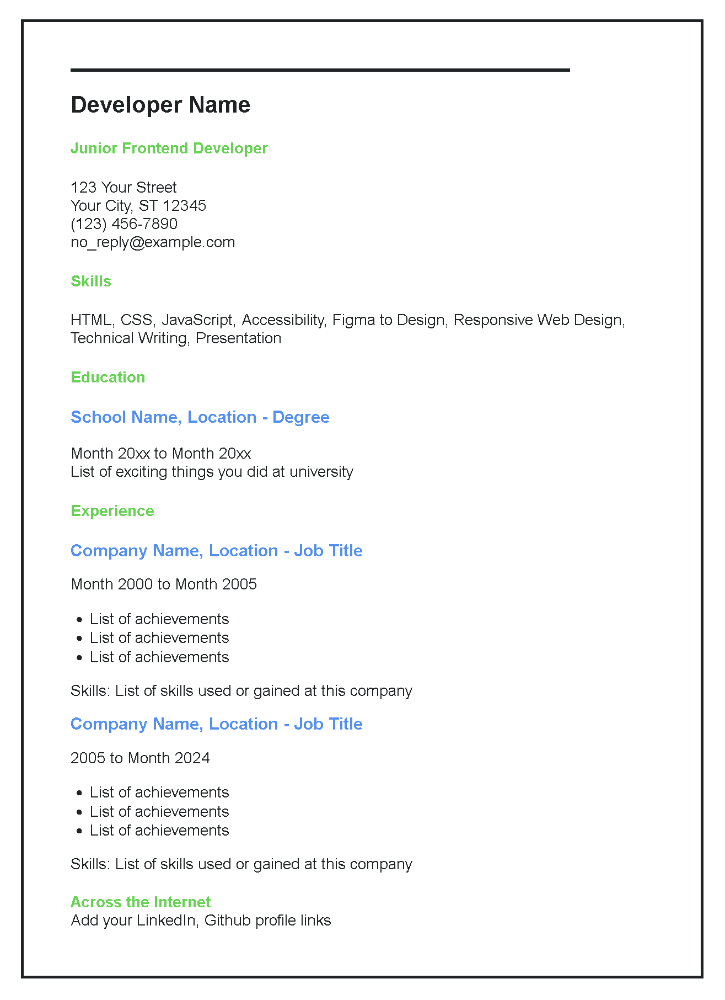

# [Roadmap.sh](https://roadmap.sh/projects/single-page-cv) - HTML Project

### **Single page CV to showcase your career history**

In this project was required to create a single page `Curriculum Vitae` using only HTML.

> The goal of this project is to teach how to create a structured, single-page CV using only HTML.
> You will focus on laying out your education, skills, and career history in a clean, semantic manner.
> _Styling will be addressed in a later project._

---

#### Key Requirements for this project:

     Semantic HTML: Use appropriate HTML tags to structure your CV.
     SEO Meta Tags: Include essential meta tags for SEO.
     Open Graph (OG) Tags: Add OG tags for better social media sharing.
     Favicon: Add a favicon for your CV page.

> The structure of your CV should be easily understandable and ready for styling in a future project.

---

#### Submission Checklist:

-   [x] Semantically correct HTML structure.
-   [x] Single-page layout with sections for education, skills, and career history.
-   [x] SEO meta tags in the head section.
-   [x] OG tags for better social media sharing.
-   [x] A favicon linked in the head section.

---

#### Other Resources i used to complete this project:

[Mozilla Developer](https://developer.mozilla.org/en-US/docs/Glossary/Semantics) - Semantics  
[Ahrefs.com](https://ahrefs.com/blog/seo-meta-tags/) - Seo Meta Tags  
[Ahrefs.com](https://ahrefs.com/blog/open-graph-meta-tags/) - Open Graph Meta Tags  
[Favicon.io](https://favicon.io/) - Favicon Generator  

---

#### License

This project is licensed under the [MIT](https://github.com/gladroe/singlepage-cv/blob/main/LICENSE)
